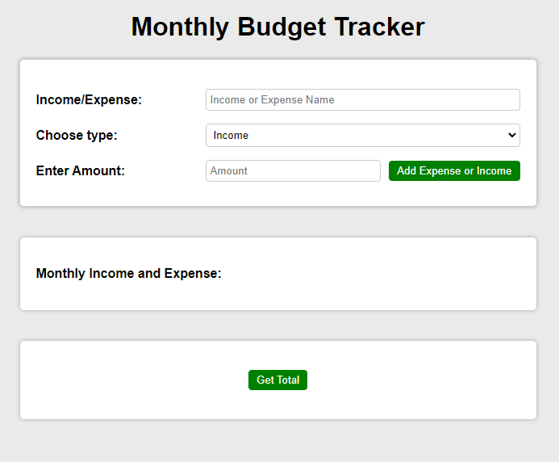
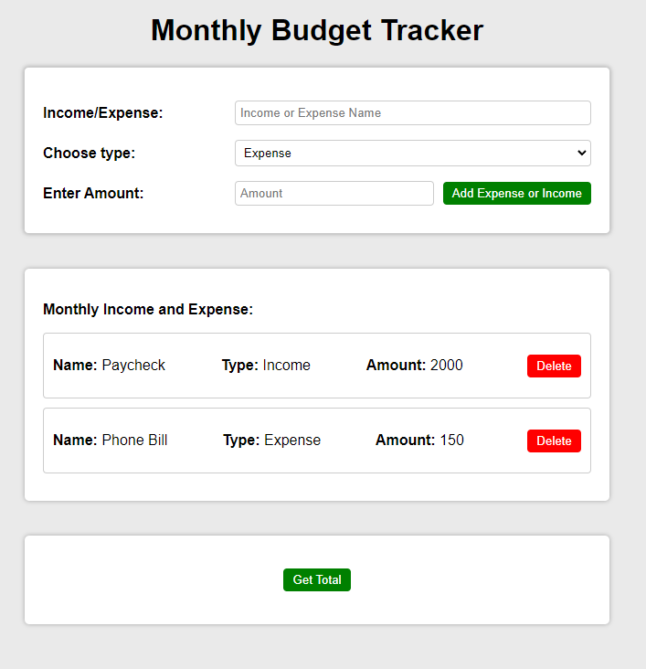
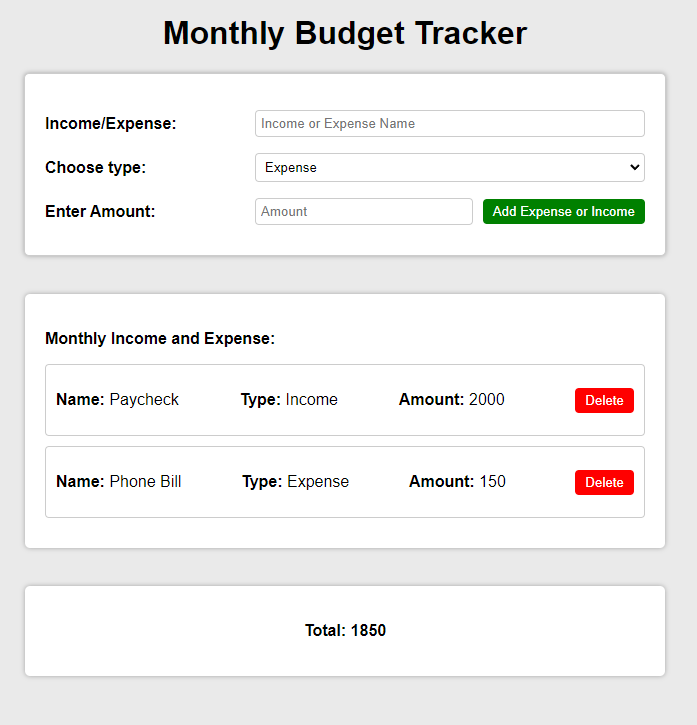

Monthly Budget Tracker
The Monthly Budget Tracker is a simple web application that allows users to track their income and expenses for the month. It provides a user-friendly interface to input and manage financial entries and calculates the total budget based on the provided data.

Technologies Used
The Monthly Budget Tracker is built using the following technologies:

HTML: Provides the structure and layout of the web application.
CSS: Styles the HTML elements to create an appealing and intuitive user interface.
JavaScript: Implements the client-side logic and interactions of the application.
Express.js: A web framework for Node.js used to handle server-side logic and API endpoints.
Axios: A JavaScript library used to make HTTP requests from the client-side to the server-side.

Files and Directories
The application consists of the following files and directories:

- index.html        // The main HTML file that defines the structure of the web page.
- index.css         // The CSS file that styles the HTML elements of the application.
- index.js          // The JavaScript file that implements the client-side logic and interactions.
- server.js         // The server-side file that sets up the Express.js server and API endpoints.
- controller.js     // The server-side file that contains the logic for handling API requests.
- README.md         // The README file providing information and instructions about the application.

Setup and Usage
To run the Monthly Budget Tracker application, follow these steps:

Make sure you have Node.js and npm (Node Package Manager) installed on your machine.

Download or clone the project repository.

Open a terminal or command prompt and navigate to the project directory.

Install the project dependencies by running the following command: npm install

Start the server by running the following command: node server.js

Open a web browser and visit http://localhost:4000 to access the Monthly Budget Tracker application.

Enter your expenses and income in the input form provided and click the "Add Expense or Income" button to add the entries.

The added entries will be displayed in the output table. You can delete an entry by clicking the "Delete" button next to it.

To calculate the total budget, click the "Get Total" button. The total amount will be displayed in the total table.

